# Deploy NTTDATA Persona Hub

This document describes the required steps to deploy the Persona Hub to Azure.

## Prerequisites

These scripts assume that the following is valid:

- The user running these scripts have elevated previleges on Azure.
- A EntraID app is already created for user authentication.
- That you have the `az` cli installed
- That you're logging with the `az` cli to both the destination subscription and to the DigitalRoom subscription

### Check that you're logging in with Azure CLI

1. on the terminal run:

```bash
$> az account list
```

The returned list should contain the destination subscription and the DigitalRoom

### Create an EntraID app registration

1. On Azure navigate to the EntraID blade, and on the right menu select "App Registrations"
2. Create a new Application following the convention "PROJ-[client-name]-PERSONAHUB-[environment]". Example: PROJ-NTTDATA-PERSONAHUB-QA.
3. On the newly created app, no the Overview panel, choose "Add certificate or secret" option:

4. Create a new Client secret and don't forget to copy its value.

## How to run these scripts

1. First make sure to update the information on `terraform\vars\[dev|qa|prod]\[dev|qa|prod].json`.
2. Initialize the terraform by running `bash deployment.sh [dev|qa|prod] plan` and plan the initial deployment.
3. If the output is valid we should get an output similar to the image below:
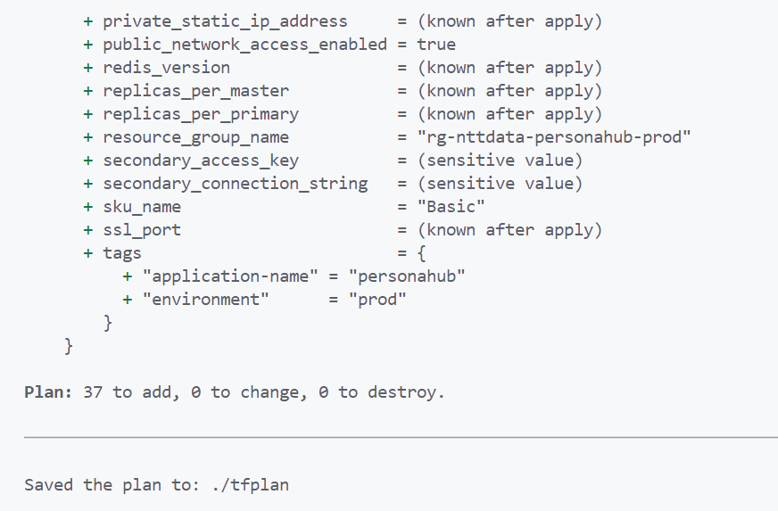
4. Run `bash deployment.sh [dev|qa|prod] apply` the make the initial deployment. If all goes well we should get an output similar to this:


## Manual changes

Currently there are some manual steps that are required to execute __after the first deployment__ :

### Database

1. Enable access to the Database to Azure local resource. For that go the the Postgres database, and on the Networking blade, select "Allow public access from Azure services and resources within Azure to this cluster" and click Save.
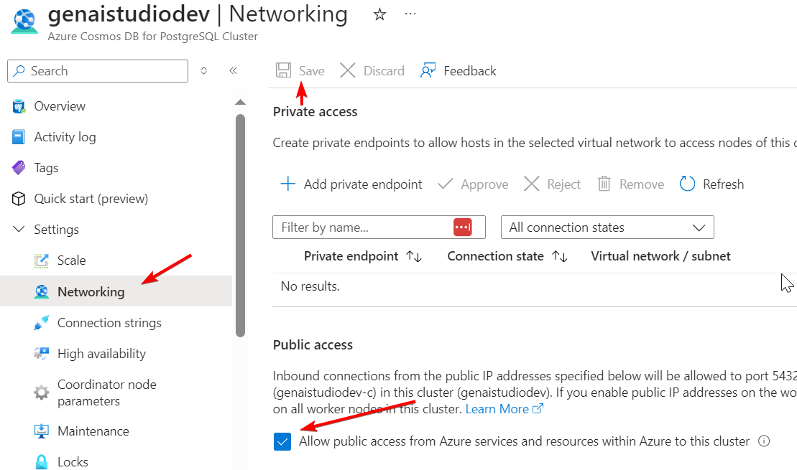
2. Just below also click on "Add current client IP address" to add your local address to the allowed IPs. We will need this later to connect to the database and update it.

#### Update Database Schema

For the Persona Hub to run, we first need to create database and update its schema.

1. Navigate to the "ca-personahub-services-global-qa" container app
2. Go to the "Application" > "Containers" blade.
3. Click on "Edit and Deploy"
4. Select the only Container image to open the edit side panel
5. On the side panel go to the "Environment Variables" tab
6. Copy the value of the "DATABASE_URL" env, and hit "Cancel" to go back.

7. We can automate the database schema update by using the existing CI/CD pipeline, available on the code repository.
8. Head out to the Azure DevOps of the project
9.  Navigate to the Pipelines menu option and choose "Create Pipeline" 

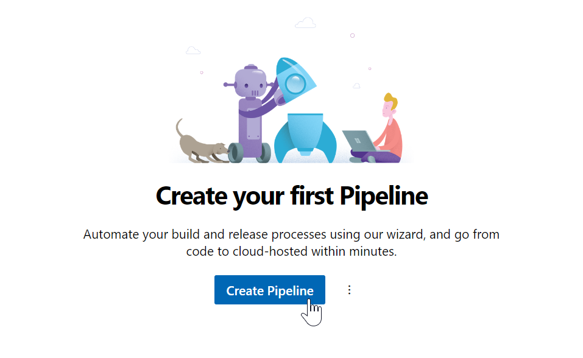
1. Select "Azure Repos Git"
2. Select the repository
3. Select "Existing Azure Pipelines YAML file"
4. On the newly open sidebar choose "/azure-pipelines-database.yml" on the "Path" dropdown and hit "Continue"
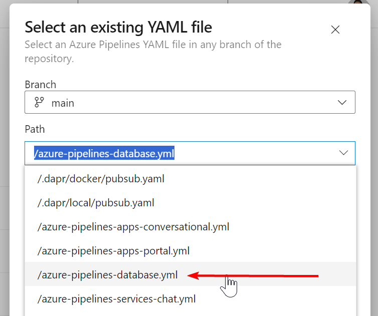
1.  On the "Review your pipeline YAML" screen, on the top right corner, select the dropdown arrow right beside "Run" and select "Save"

1.  This newly created pipeline has some dependencies. We will now configure them
2.  On the sidebar menu, navigate to "Library"

1.  Hit the "+ Variable Group" button
2.  Rename it to "AZURE"
3.  Add a variable named "DATABASE_CONNECTION_STRING"
4.  Paste the database connection string copied previously on the "Value" field
5.  Hit the lock icon to protect the value
6.  Hit "Save"
7.  Go back to the Pipelines and run the pipeline
8.  Since its the first time we are running the pipeline we need to give permissions for the pipeline to access the variables library
9.  First click on the running pipeline 

1. You should see a warning. Hit "View" and then "Permit" and again "Permit"
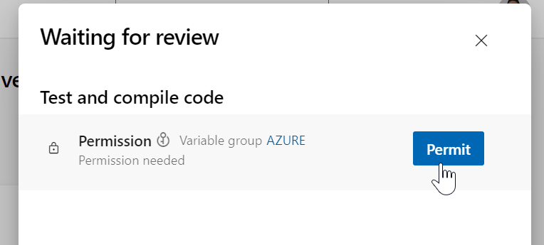
1. The pipeline should now be running and should complete with success, thus updating the database:
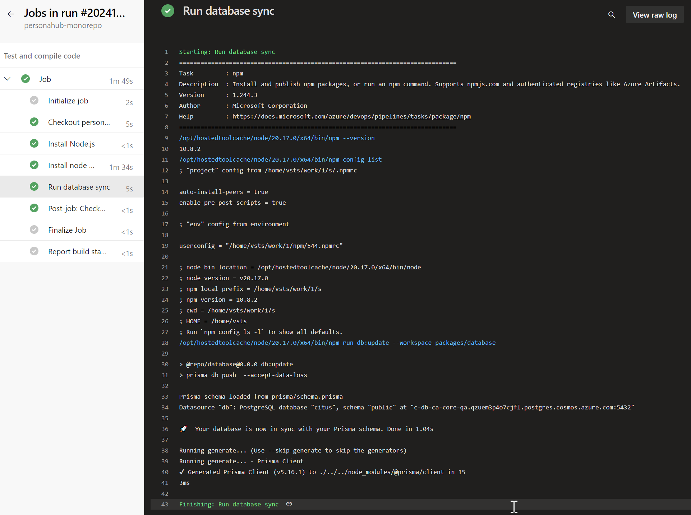

### Global Service

1. Go to the Global container app service, and on the Dapr menu blade, disable Dapr.
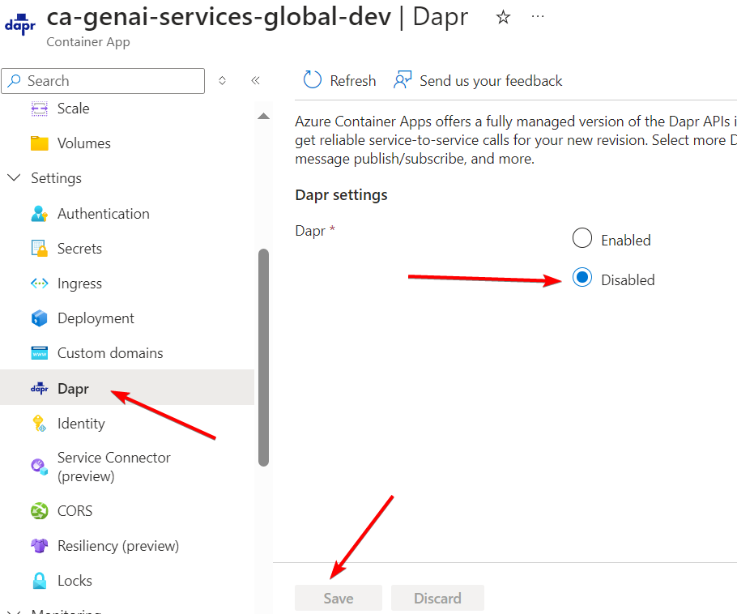
1. Go back to the Overview blade and Start/Stop the container.

1. If all goes well, the container should start sucessfully.
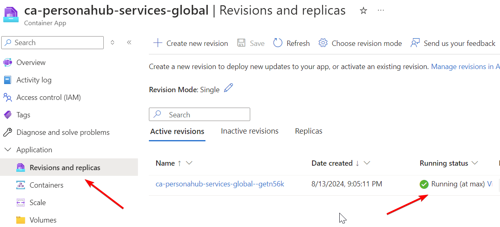
1. To check that everything went well, one should be able to use the PgAdmin tool since we've previously added our local IP to the whitelist of the database.
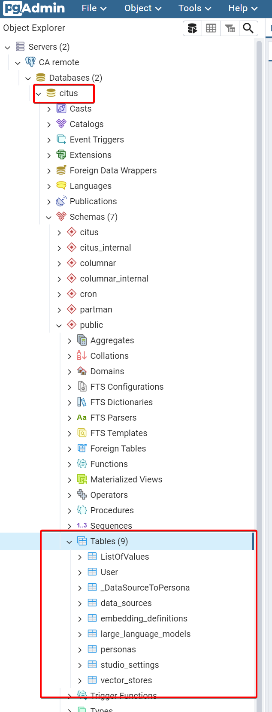

### Chat Service

1. Go the the Chat container app service, and on the Containers blade, select the Environment variables tab.
2. Click on the "Edit and deploy" option.

3. On the new blade, select the container image and click on "Edit":

4. On the side panel, update the keys below, to include "https://" at the beginning:
    1. CONVERSATIONAL_URL
    2. SERVICES_PERSONAS_URL
    3. SERVICES_LLM_URL
    4. SERVICES_GLOBAL_URL
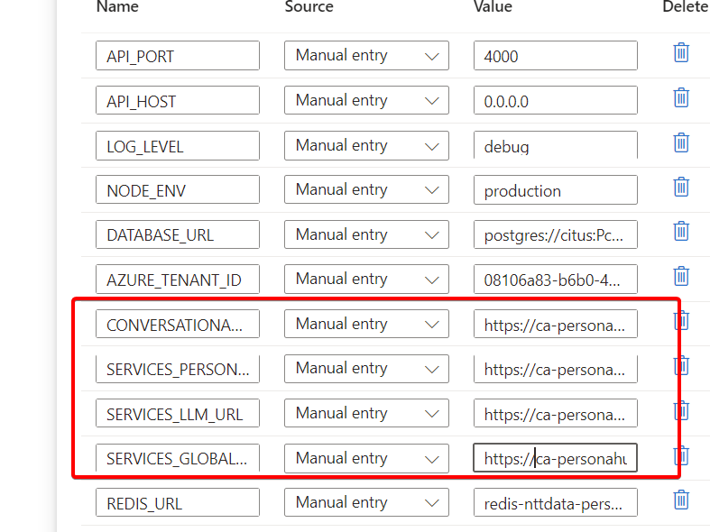
5. Hit "Save" and then "Create".

6. After a couple of seconds the service should be up and running:
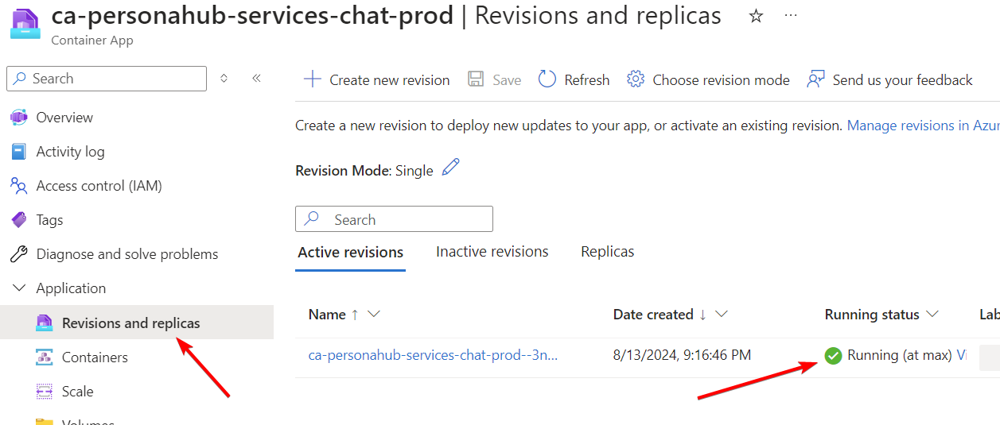

## Indexer Service

1. Go to the Studio container app, and on the Dapr menu blade, update the App port to 4001 and hit "Save".
2. Go the Indexer container app service, and on the Containers blade, select the Environment variables tab.
3. Click on the "Edit and deploy" option.

4. On the new blade, select the container image and click on "Edit"
5. On the side panel, update the keys below, to include "https://" at the beginning:
    1. SERVICES_STORAGE_URL
6. On the sama panel, add the key below with the corresponding URL
   1. SERVICES_GLOBAL_URL
7. Hit "Save" and then "Create".
8. After a couple of seconds the service should be up and running.

## Datasource Service

1. Go the Datasource container app service, and on the Containers blade, select the Environment variables tab.
2. Click on the "Edit and deploy" option.
3. On the new blade, select the container image and click on "Edit"
4. On the side panel, update the keys below, to include "https://" at the beginning:
    1. SERVICES_STORAGE_URL
5. Hit "Save" and then "Create".
6. After a couple of seconds the service should be up and running.

## Remaining services

1. Since we had to do the initial change to the database, some services may have not started correctly.
2. Go to each of the other services, and on the "Revisions and Replicas" blade validate that the service is running.
3. If not just head out to the "Overview" blade and Start/Stop the container. This should fix it.

## Studio application

1. Go to the Studio container app, and on the Dapr menu blade, disable Dapr and hit "Save".
2. Next go to the Overview blade, and copy the URL:

3. Go to the Containers blade, and click "Edit and deploy".
4. Select the container image, Edit and update the `NEXTAUTH_URL` with the copied value, hit "Save" and the "Create".
5. If all goes well, the container should start sucessfully.
6. On the Overview blade, click on the URL to open a new tab and access the site.
7. Try to login. We should now get an error:
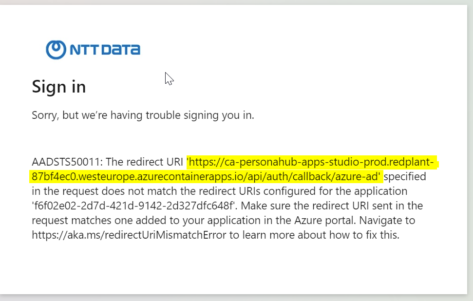
8. Copy the highlighted url.
9. Go to the EntraID service:
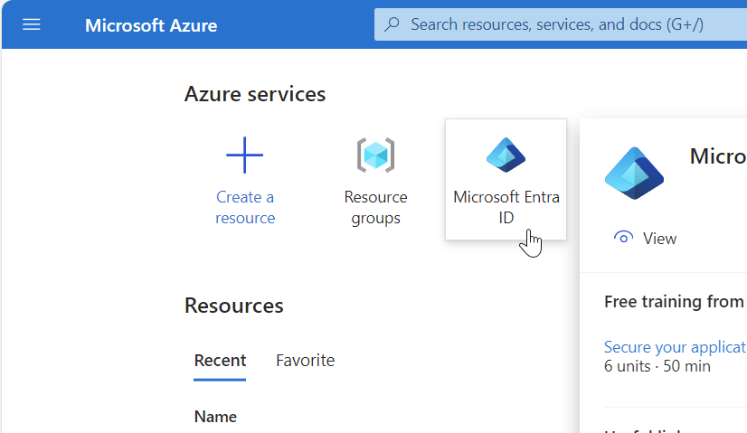
10. Go to App Registrations blade:
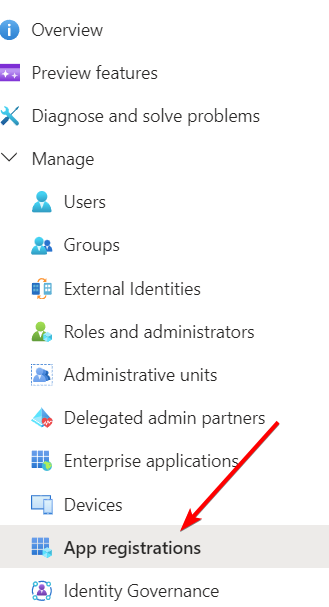
11. Select "Redirect URIs" and add a URI, using the copied URL above.


12. Hit "Save"
13. Wait a couple of seconds. If we now go back to the application tab that had the login error and hit refresh, we should now be able to login with success.
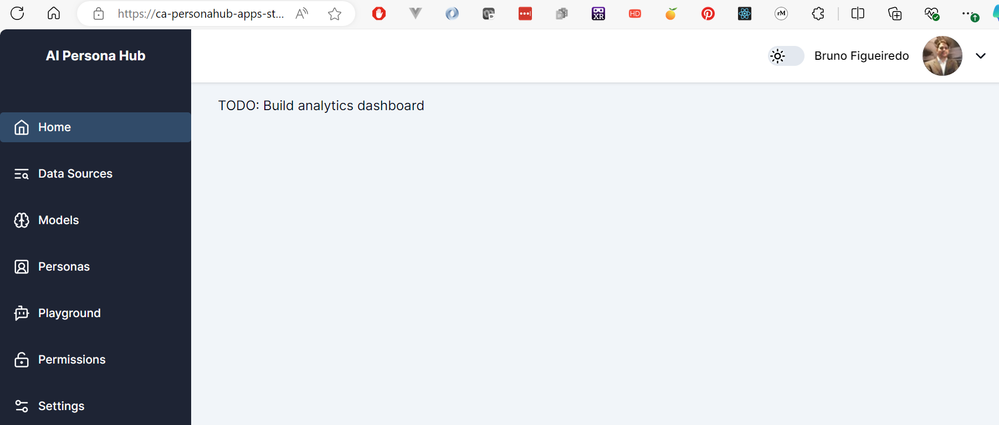

## Hub application

1. Go to the Hub container app, and on the Dapr menu blade, disable Dapr and hit "Save".
2. Next go to the Overview blade, and copy the URL.
3. Go to the Containers blade, and click "Edit and deploy".
4. Select the container image, Edit and update the `NEXTAUTH_URL` with the copied value, hit "Save" and the "Create".
5. If all goes well, the container should start sucessfully.
6. On the Overview blade, click on the URL to open a new tab and access the site.
7. On the Overview blade, click on the URL to open a new tab and access the site.
8. Try to login. We should now get an error.
9. Copy the url.
10. Go to the EntraID service.
11. Go to App Registrations blade.
12. Select "Redirect URIs" and add a URI, using the copied URL above.
13. Hit "Save"
14. Wait a couple of seconds. If we now go back to the application tab that had the login error and hit refresh, we should now be able to login with success.

## AI Search

1. Go the AI Search service, and on the Semantic ranker blade, activate the Free plan:
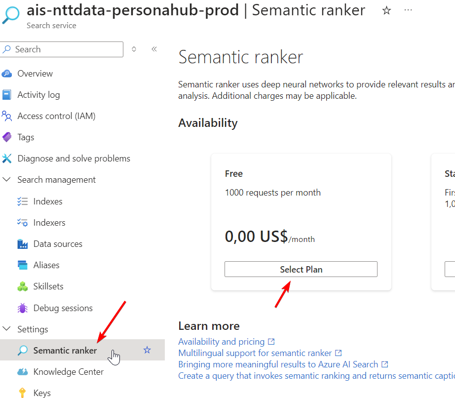
